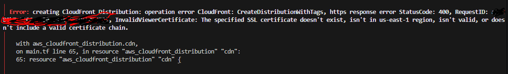

# three.js

[![NPM Package][npm]][npm-url]
[![Build Size][build-size]][build-size-url]
[![NPM Downloads][npm-downloads]][npmtrends-url]
[![Discord][discord]][discord-url]
[![DeepWiki][deepwiki]][deepwiki-url]

#### JavaScript 3D library

The aim of the project is to create an easy-to-use, lightweight, cross-browser, general-purpose 3D library. The current builds only include WebGL and WebGPU renderers but SVG and CSS3D renderers are also available as addons.

[Examples](https://threejs.org/examples/) &mdash;
[Docs](https://threejs.org/docs/) &mdash;
[Manual](https://threejs.org/manual/) &mdash;
[Wiki](https://github.com/mrdoob/three.js/wiki) &mdash;
[Migrating](https://github.com/mrdoob/three.js/wiki/Migration-Guide) &mdash;
[Questions](https://stackoverflow.com/questions/tagged/three.js) &mdash;
[Forum](https://discourse.threejs.org/) &mdash;
[Discord](https://discord.gg/56GBJwAnUS)

### Usage

This code creates a scene, a camera, and a geometric cube, and it adds the cube to the scene. It then creates a `WebGL` renderer for the scene and camera, and it adds that viewport to the `document.body` element. Finally, it animates the cube within the scene for the camera.

```javascript
import * as THREE from "three";

const width = window.innerWidth,
  height = window.innerHeight;

// init

const camera = new THREE.PerspectiveCamera(70, width / height, 0.01, 10);
camera.position.z = 1;

const scene = new THREE.Scene();

const geometry = new THREE.BoxGeometry(0.2, 0.2, 0.2);
const material = new THREE.MeshNormalMaterial();

const mesh = new THREE.Mesh(geometry, material);
scene.add(mesh);

const renderer = new THREE.WebGLRenderer({ antialias: true });
renderer.setSize(width, height);
renderer.setAnimationLoop(animate);
document.body.appendChild(renderer.domElement);

// animation

function animate(time) {
  mesh.rotation.x = time / 2000;
  mesh.rotation.y = time / 1000;

  renderer.render(scene, camera);
}
```

If everything goes well, you should see [this](https://jsfiddle.net/w43x5Lgh/).

### Cloning this repository

Cloning the repo with all its history results in a ~2 GB download. If you don't need the whole history you can use the `depth` parameter to significantly reduce download size.

```sh
git clone --depth=1 https://github.com/mrdoob/three.js.git
```

### Change log

[Releases](https://github.com/mrdoob/three.js/releases)

[npm]: https://img.shields.io/npm/v/three
[npm-url]: https://www.npmjs.com/package/three
[build-size]: https://badgen.net/bundlephobia/minzip/three
[build-size-url]: https://bundlephobia.com/result?p=three
[npm-downloads]: https://img.shields.io/npm/dw/three
[npmtrends-url]: https://www.npmtrends.com/three
[discord]: https://img.shields.io/discord/685241246557667386
[discord-url]: https://discord.gg/56GBJwAnUS
[deepwiki]: https://deepwiki.com/badge.svg
[deepwiki-url]: https://deepwiki.com/mrdoob/three.js

# My own steps

## Open git bash

clone the repo

```
git clone --depth=1 https://github.com/mrdoob/three.js.git

```

## Navigate to the folder

```
cd three.js
```

## Get it open in VS code

code .

## Click on examples and open any html of your choce

## View using live server

## To open anothe html file, right click on another html file and click open on the side.

## To view it click on

ALT L O

# Terraform

The terraform code is not configured to add so you will get this error



InvalidViewerCertificate: The specified SSL certificate doesn't exist, isn't in us-east-1 region, isn't valid, or doesn't include a valid certificate chain.
✅ Why This Happens:
You created an ACM certificate but it is not yet validated.

CloudFront only accepts validated ACM certificates in us-east-1 for custom domains.

Since you're using validation_method = "DNS" and you’re on Namecheap (not Route 53), Terraform cannot auto-validate the certificate.

✅ How to Fix:
Check ACM Certificate Status

Go to AWS Console → ACM (us-east-1 region).

You’ll see the new certificate with Pending validation status.

Get the DNS Record for Validation

Click on the certificate.

Copy the CNAME record name and value provided by AWS.

Add the CNAME to Namecheap

Go to Namecheap → Domain → Advanced DNS.

Add the CNAME record exactly as shown in ACM.

Wait for Validation

It can take 5–30 minutes for the certificate to validate.

Re-run terraform apply

Once the certificate status is Issued, rerun:

bash
Copy
Edit
terraform apply
✅ After validation, CloudFront will be able to use the SSL certificate successfully.

For Namecheap DNS:

When AWS gives you:

CNAME Name → e.g. \_a1b2c3d4e5f6.example.com

CNAME Value → e.g. \_123456abcdef.acm-validations.aws

In Namecheap Advanced DNS:

Field Value
Type CNAME
Host Only the part before your domain from the CNAME Name.
Example: \_a1b2c3d4e5f6
Value The full CNAME Value from AWS (e.g. \_123456abcdef.acm-validations.aws)
TTL Leave as Automatic

✅ Example:

AWS gives:

objectivec
Copy
Edit
CNAME Name: \_a1b2c3d4e5f6.aforodoma.com
CNAME Value: \_123456abcdef.acm-validations.aws
In Namecheap:

Host: \_a1b2c3d4e5f6

Value: \_123456abcdef.acm-validations.aws

⚠ Do NOT include .aforodoma.com in the Host field — Namecheap automatically appends your domain.
yes

When you move index.html within the structure, yu need to edit the paths to enable traffic

edit this
FIRST EDIT

````<script type="importmap">
		{
			"imports": {
				"three": "../build/three.module.js",
				"three/addons/": "./jsm/"
			}
		}
	</script>```

to

```<script type="importmap">
		{
			"imports": {
				"three": "./build/three.module.js",
				"three/addons/": "./examples/jsm/"
			}
		}
	</script>
````

SECOND EDIT

change this

````new THREE.BufferGeometryLoader()
				.setPath( 'models/json/' )
				.load( 'suzanne_buffergeometry.json', function ( geometry ) {

					material = new THREE.MeshNormalMaterial();```


          to


```// make instances
			new THREE.BufferGeometryLoader()
				.setPath( 'examples/models/json/' )
				.load( 'suzanne_buffergeometry.json', function ( geometry ) {

					material = new THREE.MeshNormalMaterial();

````

CORRECTION 3

CHANGE THIS

````<script type="importmap">
		{
			"imports": {
				"three": "../build/three.module.js",
				"three/addons/": "./jsm/"
			}
		}
	</script>```


  TO THIS

  <script type="importmap">
		{
			"imports": {
				"three": "./build/three.module.js",
				"three/addons/": "./examples/jsm/"
			}
		}
	</script>
````

# Website Performance Optimization Guide

1. Use Three.js CDN Instead of Local Files
   Replace your local Three.js files with CDN links:
   html<!-- Remove all local three.js imports -->
   <!-- Replace with CDN -->
   <script type="importmap">
   {
     "imports": {
       "three": "https://unpkg.com/three@0.158.0/build/three.module.js",
       "three/addons/": "https://unpkg.com/three@0.158.0/examples/jsm/"
     }
   }
   </script>
2. Optimize Images
   https://tinypng.com/

…or create a new repository on the command line
echo "# aforodoma-site" >> README.md
git init
git add README.md
git commit -m "first commit"
git branch -M main
git remote add origin https://github.com/AforOdoma/aforodoma-site.git
git push -u origin main
…or push an existing repository from the command line
git remote add origin https://github.com/AforOdoma/aforodoma-site.git
git branch -M main
git push -u origin main

End
End
end
